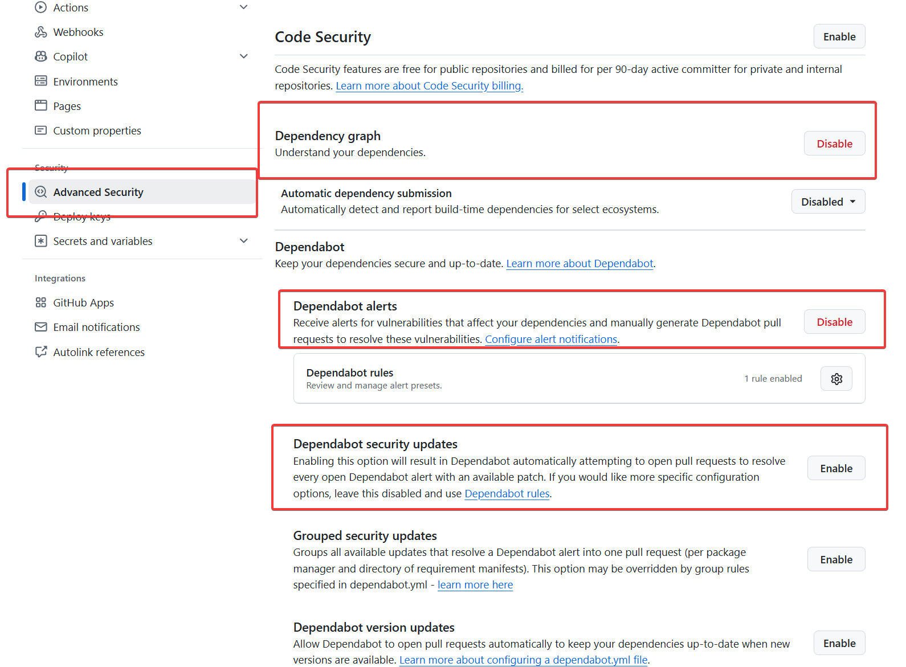
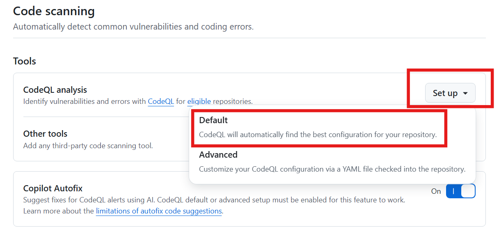
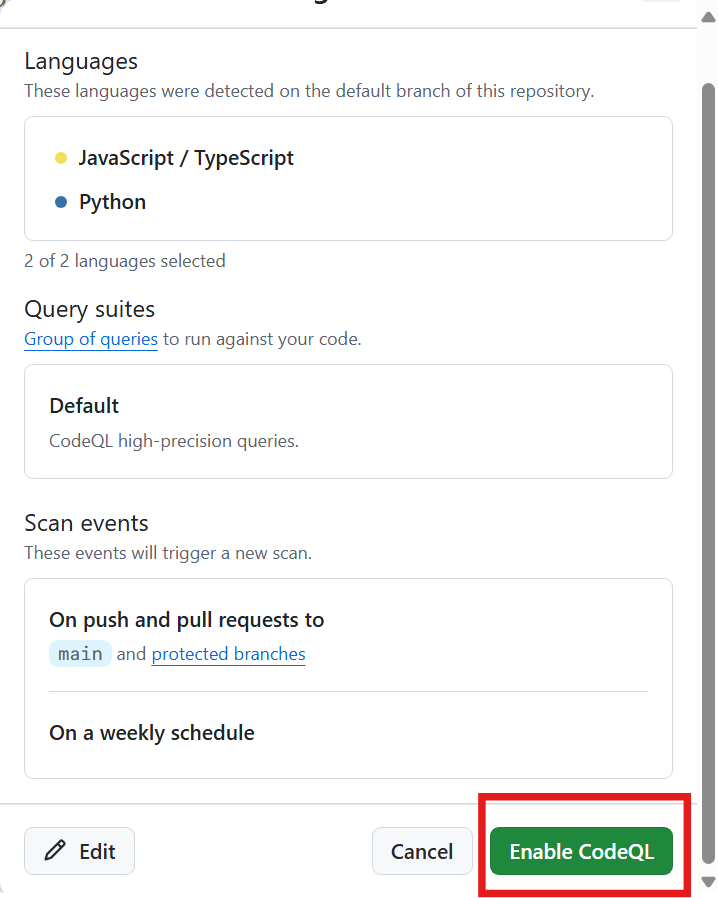
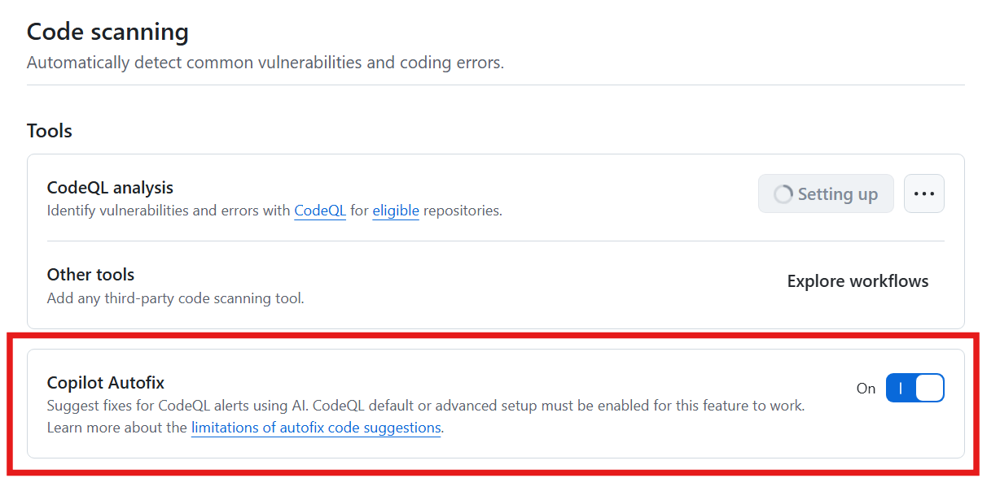
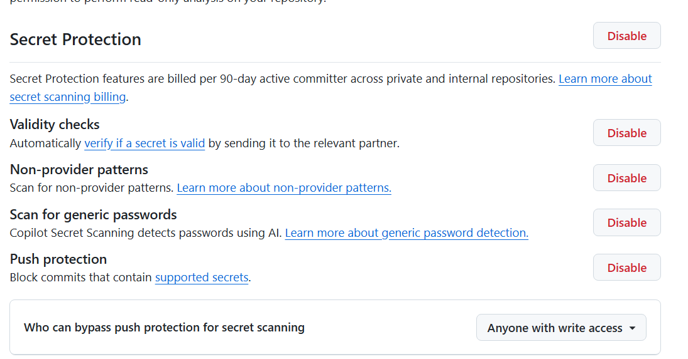

# Lab 1 - GitHub Advanced Security Feature Introduction

Welcome! In this lab, you will be introduced to GitHub Advanced Security (GHAS) and its features. You will use the Juice Shop sample repository to enable the GHAS features, manage alerts, and learn how GitHub Advanced Security can keep vulnerabilities out of your code in the first place.

> [!NOTE]
> Please note that the screenshots provided are intended to serve as general examples. While we strive to keep all information current, some screenshots may not reflect the most recent updates, as security data is continually evolving and expanding. As a result, the content and figures you observe may differ slightly from what is shown here.

<!--
> [!TIP]
> We recommend opening up two browser windows, one with the lab and one with the working copy of your repo!
-->

## Creating the repository

In this exercise, you will create a repository with code from which you can work to test the GHAS capabilities.

1. [] Navigate to +++https://github.com/Ignite-GHAS-Workshop/ghas-workshop-repo+++ in your browser. TODO: replace with correct repo
2. [] Click the green **Use this template** button in the upper right corner of the page.
3. [] Create a new repository in our organization by choosing **TODO: name of the org** in the owner dropdown.
4. [] Give the repository a unique name **lab303-<my-unique-repo-name-here>**.  Click the green link below for inspiration on a unique repo name 😉.
5. [] Make sure you switch it to visibility **Private** so your work does not conflict with other attendees!  Now click **Create repository**.
6. [] The page will refresh after a few seconds where you can now see the code we will be working with.  

## Enabling the security settings

In the following exercises, you will be guided through the process of enabling the remaining GHAS features. Then you will be shown how to use the features to secure your code.

### Exercise 1: Enable Dependabot

Although Dependabot isn't part of the GitHub Advanced Security product suite, it is still an important tool to discuss from an overall security posture.

Dependabot and Dependency Graph should already be turned on for your repository. If not, follow the steps below.

1. [] We first want to turn on the security settings for the repository. Navigate to the **Settings** tab (the icon of the gear) in the repo.
2. [] Click on the  **Advanced Security** section.
3. [] Ensure the Dependency Graph is enabled (scroll down to **Code Security** group).  This will be indicated by a red **Disable** button.  If there is a black **Enable** button, click it to enable the **Dependency Graph** setting. To enable Dependabot, we first have to enable the Dependency Graph. This allows Dependabot to ingest your package manifest files.
4. [] Ensure the Dependabot alerts are enabled.  This will be indicated by a red **Disable** button.  If there is a black **Enable** button, click it to enable the **Dependabot alerts** setting. This feature will create alerts for vulnerable dependencies found in your repository.
5. [] Click the **Enable** button next to the **Dependabot security updates** setting.
    - This will automatically create pull requests to update your vulnerable dependencies (if there is a non-vulnerable version to upgrade to).
    - Note: there is a [maximum number of pull requests that this feature will create (10)](https://docs.github.com/en/enterprise-cloud@latest/code-security/dependabot/working-with-dependabot/troubleshooting-dependabot-errors#dependabot-cannot-open-any-more-pull-requests).

Once you are done turning on Dependabot features, the next thing we will need to do is turn on GitHub Advanced Security features.

### Exercise 2: Enable Code Security

1. [] Next, let's enable **Code Scanning with CodeQL**. These settings are also under the **Advanced Security** settings page.
2. [] Ensure **Code Security** is enabled.  This will be indicated by a red **Disable** button.  If there is a black **Enable** button, click it to enable **Code Security**.
3. [] Underneath the **Code Security | Tools** heading, click the **Set up** button in the **CodeQL analysis** row.

> [!NOTE]  
> If you do not see the **Code scanning** heading on the **Code security** page after enabling **Code Security** - you have likely not created your repo in the proper Organization. Go back to the beginning of this lab and ensure you choose **TODO: ORG NAME** value from the dropdown as the new repository **Owner** when you choose **Use this template**.

4. There are two options: **Default** and **Advanced**. Select the **Default** option and review the settings.
    - For this lab, we will use the **Default** setup, which creates a managed Actions workflow (i.e. you will not see a codeql.yaml file committed to the repo). The Advanced option can be used to manage your code scanning workflow as a GitHub Actions workflow YAML file committed to the repo. The **Default** option is a great option to get started quickly to enable code scanning in a repository without needing to commit any additional code.
    - By default, it will scan the JavaScript code, use the default CodeQL queries (for highest precision), and scan the default branch on push, pull request, and on a weekly schedule.

  

  
5. [] Click the **Enable CodeQL** button to save the settings and enable Code Scanning.

  

  
6. [] Ensure that **Copilot Autofix** slider is enabled as **On |** (in the **Code Security --> Tools** section).

  

> [!NOTE]  
> You do not need a Copilot license in order to use the Copilot features with GitHub Advanced Security. However, Copilot can certainly be helpful in resolving issues in your IDE by using Copilot chat to explain the vulnerability and how to fix it.

7. [] Optionally, configure the **Check runs failure threshold** (in **Protection Rules** section) - by default, a pull request will be blocked if there are any high or higher security alerts _once_ you configure a branch ruleset.

### Exercise 3: Enable Secret Protection

1. [] Ensure that Secret Protection is enabled.  This will be indicated by a red **Disable** button.  If there is a black **Enable** button, click it to enable **Secret Scanning**.
2. [] Click the **Enable** button next to the **Validity checks** setting. This feature checks if the secret is still valid for [specific partners](https://docs.github.com/en/enterprise-cloud@latest/code-security/secret-scanning/introduction/supported-secret-scanning-patterns#high-confidence-patterns), such as Azure, AWS, and, of course, GitHub. As an example, you can use this feature to check if a GitHub personal access token found in the repo is still valid and needs to be revoked.
3. [] Click the **Enable** button next to the **Non-provider patterns** setting. This scans for patterns that do not correspond to partners but still have a common syntax, such as a MySQL or MongoDB connection string.
4. [] Check the box to **Scan for generic passwords**. This feature uses AI to find secrets/passwords that may be in your code that do not correspond to a known provider pattern.
5. [] Click the **Enable** button next to the **Push protection** setting. This feature will block pushes that contain high-precision secrets. You can use this [chart](https://docs.github.com/en/enterprise-cloud@latest/code-security/secret-scanning/introduction/supported-secret-scanning-patterns#supported-secrets) to determine which types of secrets would be blocked with secret scanning push protection enabled.
6. [] Optionally, configure **Who can bypass push protection for secret scanning**.
    - By default, as to not interrupt developers' workflows, anyone with write access to the repository can manually bypass a blocked push that contains secrets (administrators will be notified of this, and it is also captured in the audit logs).
    - In Private and internal repositories in organizations using GitHub Enterprise Cloud with GitHub Advanced Security enabled, you can change this to only allow select roles/teams (or no one) to bypass secret scanning push protection.
7. [] Note that you can define your own **Custom patterns** from this page to scan for secrets that do not correspond to a known provider pattern.

  

## Summary

Congrats! You have successfully enabled all of the security settings on your repository. In the next lab, we will review the alerts that have been created and how to manage them.

➡️ Head to the next [lab](lab2.md).
