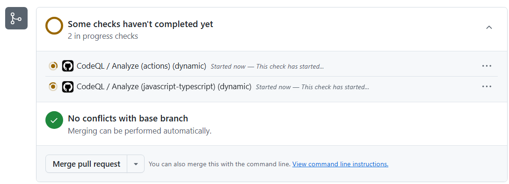
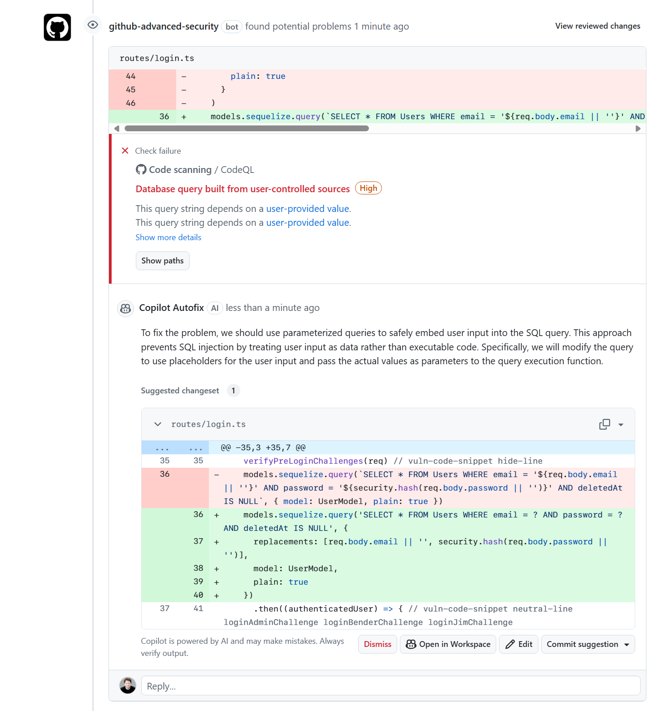
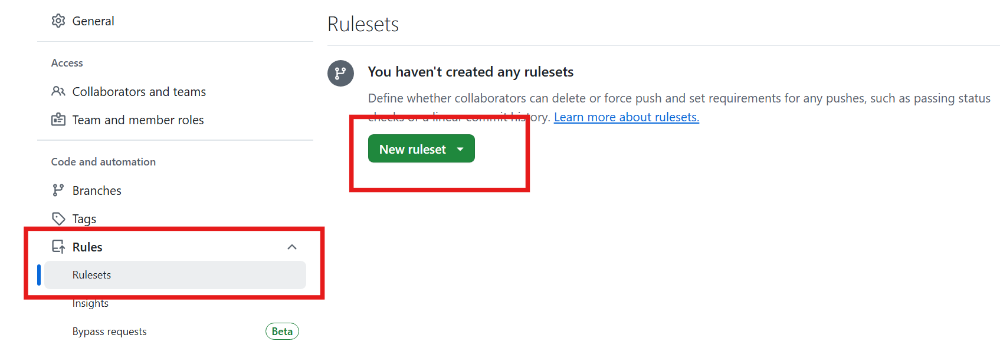
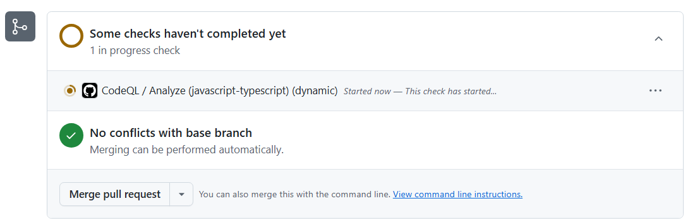
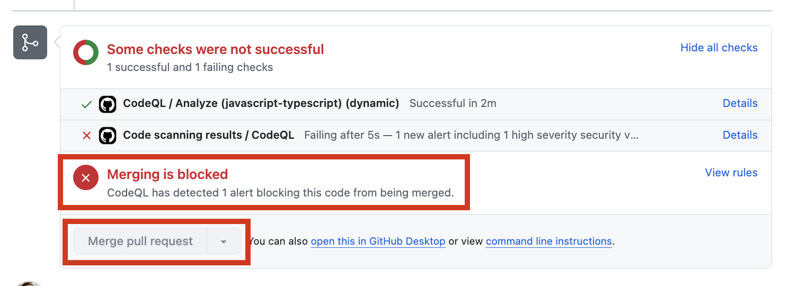

# Lab 3 - Hands-on with Code Scanning

With Code Scanning enabled, we want to block vulnerable code from entering the codebase. We can define a repository ruleset to enforce this.

## Exercise 1: Introduce a code scanning security vulnerability

1. Navigate to the **routes/login.ts** file in your repository (make sure the **Code** tab is selected).
2. Click the Pencil icon on the top right of the file view to edit the file.
3. Find lines 36-46 and delete them

```diff
- models.sequelize.query(
-       'SELECT * FROM Users WHERE email = :email AND password = :password AND deletedAt IS NULL',
-       {
-         replacements: {
-           email: req.body.email || '',
-           password: security.hash(req.body.password || '')
-         },
-         model: UserModel,
-         plain: true
-       }
-     )
```

4. At line 36, add the following code:

```javascript
models.sequelize.query(`SELECT * FROM Users WHERE email = '${req.body.email || ''}' AND password = '${security.hash(req.body.password || '')}' AND deletedAt IS NULL`, { model: UserModel, plain: true })
```

5. Let's push our new branch with the vulnerability up to GitHub.
6. Click the green **Commit Changes** button on the top right of the file view.
7. Keep the commit message the same, but feel free to add a description.
8. Select the **Create a new branch for this commit and start a pull request** radio button.
9. Keep the branch name at the default, which should be your GitHub handle followed by **-patch-1**.
10. Click the **Propose changes** button.
11. Click the **Create pull request** button at the bottom of the text field in the next view.
12. The page will redirect to the pull request that was just created. Do not merge the pull request yet, as we want to see the code scanning results first.
13. After the pull request is created, the code scanning job will have been initiated. You can see the status of the job in the pull request checks. It will take a few minutes to run.

<details>

  
</details>

10. CodeQL should find the vulnerability, so the check will fail. Also, we should see Copilot create us an autofix on the PR as a code suggestion change that we can review (and commit)
11. It might take Copilot a few moments to create the autofix.
12. Review the autofix - we can prevent a vulnerability from entering the repository now with a click of a button! 🎉 ⚠️⚠️ **But don't commit the suggestion yet.** ⚠️⚠️

<details>

  
</details>

## Exercise 2: Creating a code scanning ruleset

Without a ruleset (GitHub's new version of branch protections), even though CodeQL found the vulnerability, a developer could still merge the code mistakenly, or merge the code before the CodeQL checks finish. Let's prevent this!

> [!NOTE]  
> We want to wait for the PR check to finish entirely (with a pass or fail) before creating the ruleset!

1. Let's go into the **Settings** tab of the repository (we will be adding a branch ruleset).
2. On the left hand list of options, click on **Rules --> Rulesets**.

<details>

  
</details>

3. Click on **New ruleset ▾ --> New branch ruleset**
4. Create the ruleset:
    1. Give the ruleset a **name** (any name is fine)
    2. Change the **enforcement status** to **Active**.
    3. Under **target branches**, click **Add target** and select **Include default branch**.
    4. Scroll down and check the **Require code scanning results** box
    5. The CodeQL tool should already be there - there's nothing to change
5. Scroll down and click the **Create** button.

<details>

  
</details>

7. With the ruleset created, both the JavaScript scan has to finish and no vulnerabilities found with CodeQL in order to merge the code.
8. Navigate back to our open PR. The **Merge pull request** button should now be grayed out (there also a big red icon and the text **Merging is blocked** with the list of blocking reasons underneath), preventing us from merging vulnerable code.

<details>

  
</details>

9. Review the **Copilot Autofix suggestion**.
10. Click on the **commit suggestion** button and **commit changes**.
11. After another CodeQL scan, the PR should pass and the **Merge pull request** button should be enabled, allowing you to merge the change without the vulnerability.
    - ➡️ For the purposes of this lab, you don't have to actually merge the PR, so **you don't have to wait fo the CodeQL scan to finish before moving on**.
12. Celebrate 🎉! We just prevented a security vulnerability from entering our codebase!

## Summary

Excellent!  In this lab we saw how GitHub code scanning can find bugs in the pull request and suggest solutions for them. And we learned how to use repository rulesets to block a pull request from merging until the checks are resolved.

In the next lab, we are going to learn about Dependency Review, and how it can help us stop bad dependencies from making it to the default branch.

➡️ Head to the next [lab](lab4.md).
