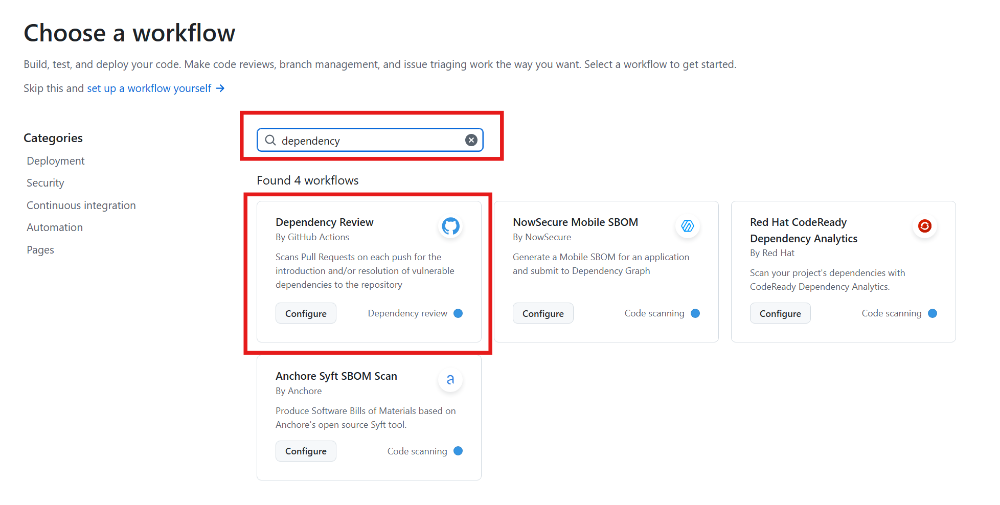
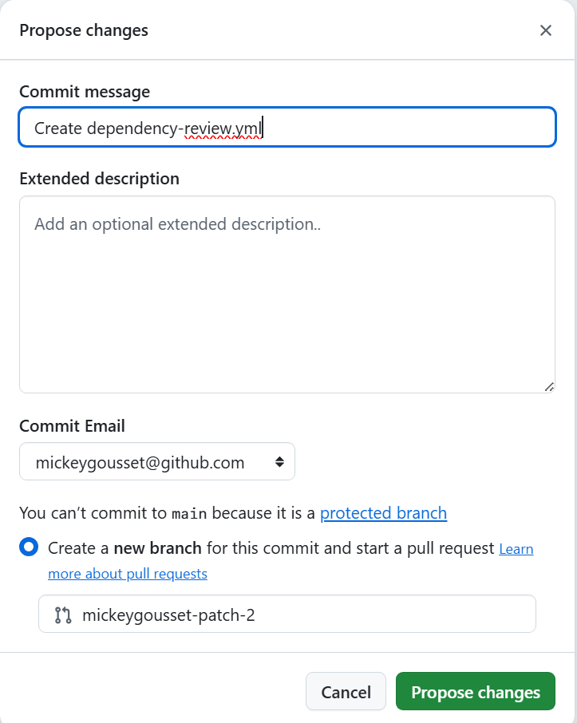
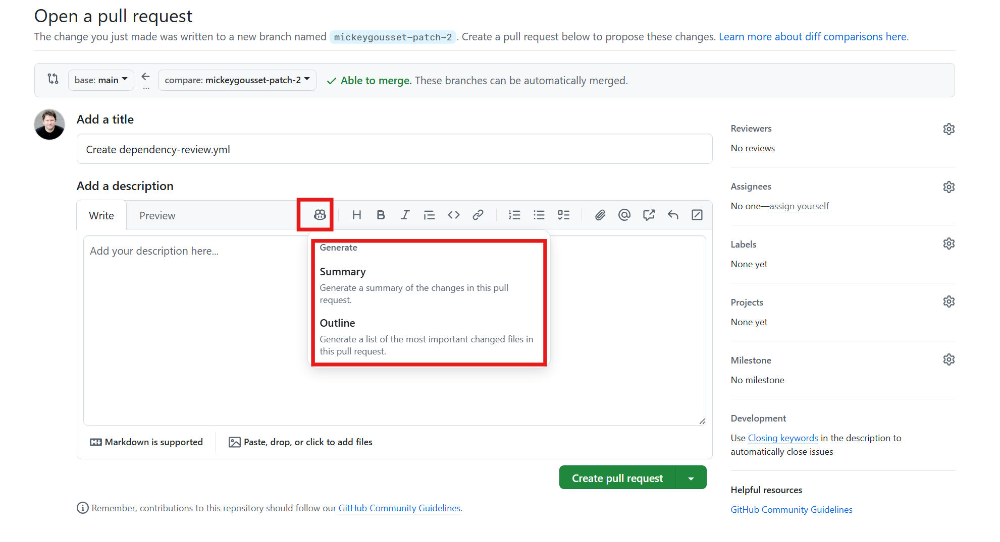
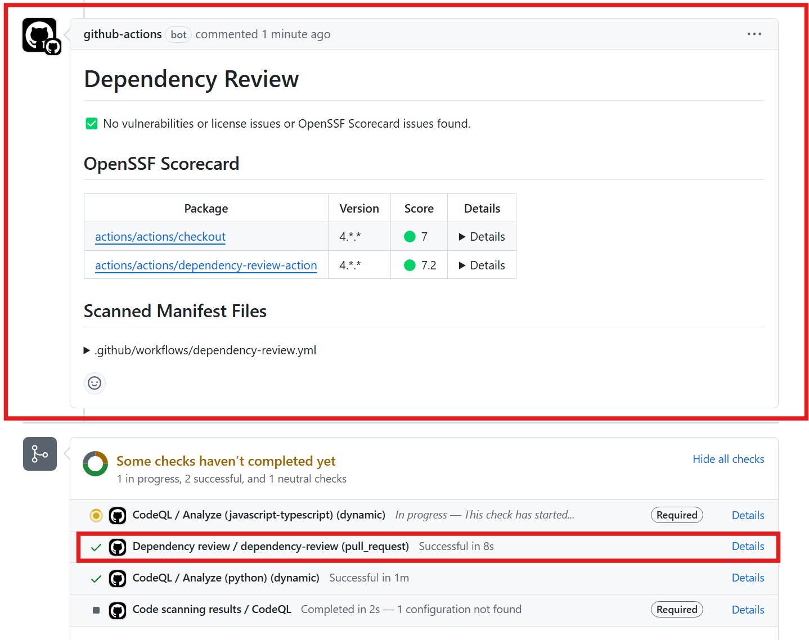
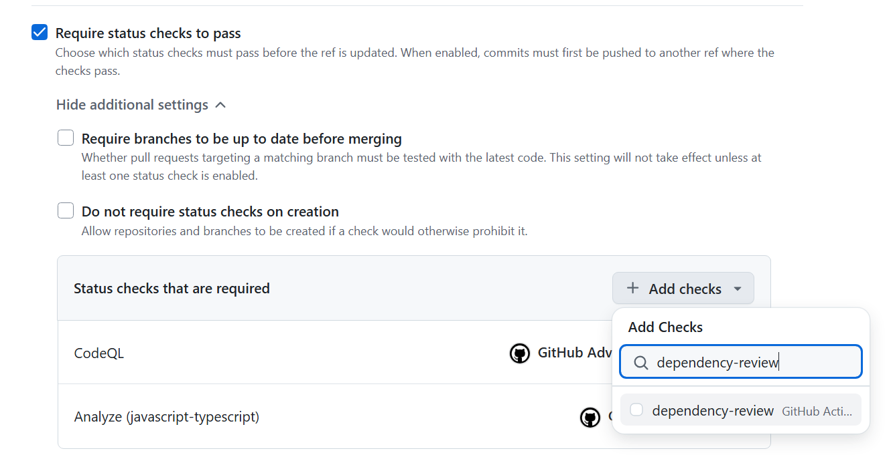
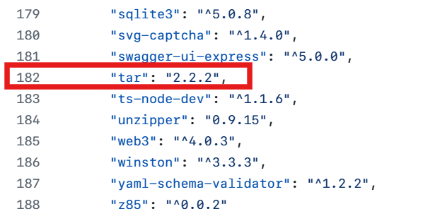
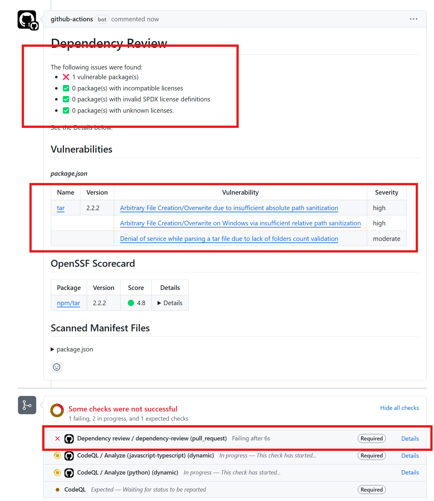

# Lab 4 - Hands-on with Dependency Review

With Dependency Review enabled and configured, we want to block vulnerable packages from entering the codebase. We can define a repository ruleset to enforce this as well!

## Exercise 1: Add the Dependency Review Action

First, let's add the dependency review action workflow.

1. In the repository, click on the **Actions** tab.
2. Click on the **New workflow** button in the upper left.
3. Search for "**dependency**" and click enter on your keyboard.
4. Under the **Dependency Review** workflow, click **Configure**.

<details>

  
</details>

5. Review the action **actions/dependency-review-action** and its inputs after **with:**. The options are going to be commented out so default values will be used. For example this action can also block specific open source license types or you can configure the severity of the vulnerabilities to be flagged.
6. In the upper right, click on **Commit changes...**
7. Since we have a ruleset, we have to create a branch and merge this to main via pull request. Create a branch and commit (**Propose changes**) the changes.

<details>

  
</details>

8. On the next screen, If you have a Copilot license use the Copilot icon  in the formatting bar to generate a pull request description.

<details>

  
</details>

9. Click **Create pull request**.
10. Wait for the code scanning job to finish. It will take a few minutes to run.
    - You will notice that the Dependency Review workflow ran against this PR and didn't report any issues.

<details>

  
</details>

11. Merge the PR once the code scanning completes.
12. Navigate to **Settings** of the repo.
13. Navigate to **Rules --> Rulesets**.
14. Click on the name of the ruleset you created in **lab 3** to modify it.
15. Enable the check box for **Require status checks to pass** (scroll down or use search)
16. Click on **Add checks**.
17. Search for `dependency-review` and add it (it should show up under **suggestions**).

<details>

  
</details>

18. Save the changes to the ruleset.

## Exercise 2: Introduce a dependency vulnerability

Now, let's attempt to add a vulnerable dependency to the codebase and test out the dependency review feature.

1. Navigate back to the **Code** tab in the repo.
2. Click the **package.json** file in the root of the repository to open it.
3. Click the **pencil** ✏️ icon at the top right of the file to go into edit mode.
4. Go to the end of line 181 and hit Enter to create a blank line for line 182.
5. Add the following code to line 182, making sure to include the comma at the end of the line:

```
"tar": "2.2.2",
```

<details>

  
</details>

6. Click the **Commit changes** button.
7. Change the branch name to **lab4/dependency-vulnerability** and click **Propose changes** to start a pull request.
8. Use the **Copilot** button in the formatting bar to generate a PR summary for you.
9. Click the **Create pull request** button.
10. Wait for the dependency review job to finish.
11. It should make a comment to the pull request with a note that it found a vulnerable package dependency. In fact, adding this one package would introduce 3 new vulnerabilities to our codebase.

<details>

  
</details>

12. Also, the status check will be marked as failed, preventing the pull request from being merged since we have made dependency review a required check.

## Summary

Celebrate 🎉! We just prevented a security vulnerability from entering our codebase! Without dependency review, if a pull request from this branch was opened to main, nothing would prevent the vulnerability from being introduced.

In the next lab, we are going to go hands-on with secret protection, and see how we can use push protection to stop secrets from being pushed to GitHub.

➡️ Head to the next [lab](lab4.md).
