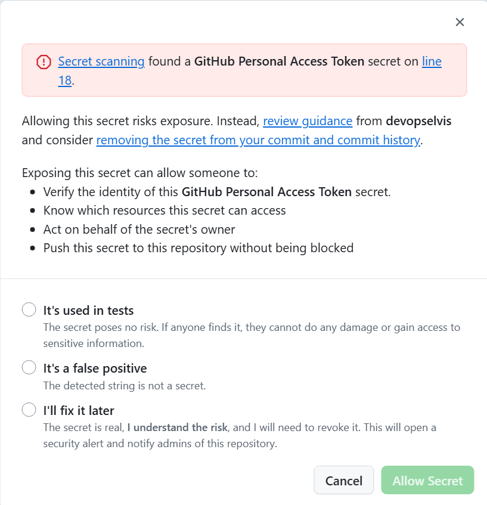

# Lab 5 - Hands-on with Secret Scanning

Let's use Secret Scanning with push protections to prevent secrets from entering the codebase!

## Exercise 1: Attempt to commit a secret

1. Let's try to commit a secret to the repository to test out the secret scanning push protection feature.
2. But first, we need a secret to commit! The easiest is to generate a GitHub personal access token (with limited scopes) and attempt to commit it.
3. In a new browser tab, navigate to github.com and click on your **user profile picture** in the upper right and click on **Settings**.
4. In the lower left of the list of options, click on **Developer settings**.
5. Click on **Personal Access Tokens** to expand and click on **Fine-Grained Tokens**.
6. Generate a **new token**.
7. Don't give the token any permissions - just give it a **name** and scroll down to the bottom and **Generate token**.
8. **Copy**  the value of the token to the clipboard.
    - Note: If you leave this page, you will not be able to copy the token again. If you lose the token from the clipboard, either regenerate the token or create a new one.
9. Now, let's attempt to commit the token to the repository.
10. Any file would work, but for example, we can open up the `routes/login.ts` file we edited earlier.
11. As an example, on line 18 you can add `const secret = "<YOUR TOKEN>";`, replacing **<YOUR TOKEN>** with the token you just generated - it should start with **github_pat_**.
12. Commit the file and then push the file to the repo.
13. Push protection should detect the GitHub personal access token and block the push - great!

  In the UI:   

14. Depending on how the settings are configured, we could bypass the push protection and push the secret to the repository. But, we don't want to do that! 🙅‍♂️ Repository admins and organization owners would receive an email notification if we did.

## Summary

Celebrate 🎉! We just prevented a secret from entering our codebase!

And there you have it. You should now have a good grasp on what GitHub Advanced Security is, how it works, and how to implement it. So get out there and keep your company secured!

➡️ Head to the next [lab](lab5.md).
